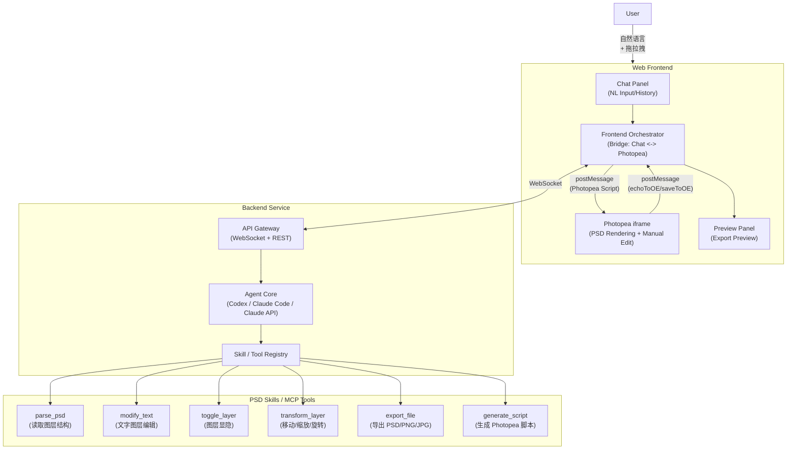
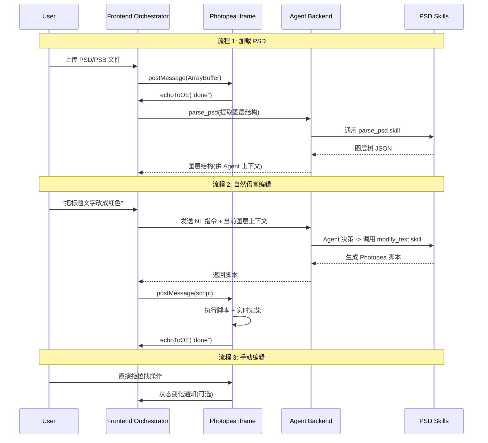

# 自然语言 PSD/PSB 编辑 Agent -- v1 顶层架构设计

> **版本**: v1
> **更新日期**: 2026-03-26
> **状态**: 初稿，待讨论确认

---

## 一、PSD 引擎选型 Trade-off 分析

### 方案 A: Photopea iframe 嵌入

- **能力**: 完整 PSD/PSB 支持、Adobe 兼容脚本 API、内置渲染、原生拖拉拽
- **集成方式**: iframe + `postMessage` 双向通信，Agent 生成 Photopea JS 脚本发送执行
- **脚本示例**: `app.activeDocument.artLayers[0].textItem.contents = "新文字"` 改文字, `app.activeDocument.layers[1].visible = false` 隐藏图层
- **优势**: 开发量最小，1-2 周出 MVP；实时渲染和手动编辑"免费获得"；免费嵌入
- **劣势**: UI 定制受限（iframe 边界明显）；依赖第三方；whitelabel 需 $500-2000/月；Agent 只能通过脚本间接操作，观测性有限
- **适合场景**: 快速验证想法，MVP 阶段

### 方案 B: ag-psd (JS) 自研

- **能力**: 读写 PSD、图层操作、文字图层（不完整）
- **致命缺陷**: **不支持 PSB**、不支持 CMYK/16-bit、不自动合成图层位图、文字图层不完整
- **开发量**: 巨大 -- 需要自建 Canvas/WebGL 渲染引擎（相当于造一个 mini-Photoshop）
- **结论**: 如果需要 PSB 支持，此方案直接排除

### 方案 C: Python 后端 (psd-tools / Aspose.PSD) + Web 前端

- **psd-tools**: 开源，1.3k stars，读 PSD 好，写能力有限，不支持 PSB 写入
- **Aspose.PSD**: 商业库（$999+/年），完整支持 PSD+PSB 读写，功能强大
- **架构**: 后端解析 PSD 为图层结构 + 栅格化图片 -> 前端 Canvas 渲染
- **优势**: 后端完全可控，Python 生态丰富，和 Codex/Claude Code 的 skills 对接天然
- **劣势**: 每次操作需服务端往返（延迟）；前端渲染仍需自建；PSD 合成复杂度高
- **适合场景**: 对可控性要求高，接受开发周期长

### 方案 D (推荐): Photopea 内核 + AI 编排层

- **核心思路**: Photopea 负责 PSD 引擎 + 渲染 + 手动编辑；自研 AI 层负责自然语言理解和操作编排
- **为什么推荐**:
  - 面向普通用户 + 基础操作 + Web 优先 -> Photopea 完全覆盖
  - 手动拖拉拽需求 -> Photopea 原生支持
  - 实时渲染 -> Photopea 内置
  - 最快能验证核心价值：**自然语言 -> 图片编辑** 这个核心链路
- **演进路径**: MVP 用 Photopea，验证后可逐步替换为自研引擎

---

## 二、顶层架构

### 架构总图



### 核心数据流



---

## 三、Agent 集成策略

### 3.1 两种部署模式

**模式 A: 本地开发模式 (Codex / Claude Code)**

- Codex 或 Claude Code 作为本地 Agent 运行
- 通过 Skills（Codex）或 MCP Server（Claude Code）扩展 PSD 操作能力
- 适合: 开发调试、个人使用、概念验证
- 流程: 用户在终端/IDE 中用自然语言指令 -> Agent 调用 PSD skill -> 生成脚本 -> 通过 WebSocket 推送到前端 Photopea 执行

**模式 B: 生产部署模式 (Claude API / OpenAI API)**

- 使用 Claude Agent SDK 或 OpenAI Function Calling 构建服务端 Agent
- PSD Skills 封装为 MCP Server 或 Function Tools
- 适合: 面向终端用户的 Web 产品
- 流程: Web 前端 -> API Gateway -> Agent 服务 -> 调用 Tools -> 返回脚本 -> 前端执行

**推荐**: 先用模式 A 快速原型，验证核心链路后再迁移到模式 B。两种模式的 Skills/Tools 定义是共享的，迁移成本低。

### 3.2 Skills / Tools 设计

所有 PSD 操作抽象为标准化的 Tool 接口，兼容 MCP 协议和 Codex Skills：

```
Tool: parse_psd
  Input: { file_path: string }
  Output: { layers: LayerTree, metadata: DocInfo }

Tool: modify_text_layer
  Input: { layer_name: string, text?: string, font_size?: number, color?: RGB }
  Output: { script: string }  // Photopea JS script

Tool: toggle_layer_visibility
  Input: { layer_name: string, visible: boolean }
  Output: { script: string }

Tool: transform_layer
  Input: { layer_name: string, translate?: [x,y], scale?: [sx,sy], rotate?: degrees }
  Output: { script: string }

Tool: export_document
  Input: { format: "psd"|"png"|"jpg", quality?: number }
  Output: { script: string }

Tool: get_layer_info
  Input: { layer_name: string }
  Output: { type, bounds, opacity, blend_mode, visible, text_content? }
```

关键设计: **每个 Tool 的输出是 Photopea 脚本字符串**，前端直接通过 postMessage 发给 Photopea 执行。Agent 不直接操作文件，而是生成操作脚本。

### 3.3 Agent 的 System Prompt 核心

Agent 需要知道:

- 当前 PSD 的图层结构（通过 parse_psd 获取）
- 可用的操作工具列表及参数
- Photopea 脚本 API 的基本语法（作为 few-shot 参考）
- 用户意图到工具调用的映射逻辑

---

## 四、关键架构决策

### 4.1 "前端执行"而非"后端执行"

- Photopea 运行在用户浏览器中（iframe），所有 PSD 操作在客户端完成
- 后端 Agent 只负责"理解意图 + 生成脚本"，不接触 PSD 文件本身
- 好处: 无需服务端处理大文件，低延迟，隐私友好

### 4.2 图层上下文同步

- PSD 加载后，前端通过 Photopea 脚本提取图层树 JSON
- 图层树作为 Agent 的上下文传入（每次对话附带）
- 手动拖拉拽操作后需要重新同步上下文（通过定时轮询或操作钩子）

### 4.3 操作原子性与撤销

- 每条自然语言指令可能生成多条 Photopea 脚本
- 利用 Photopea 的 History 机制实现撤销
- Agent 可以调用 `app.activeDocument.activeHistoryState = app.activeDocument.historyStates[n]` 回退

---

## 五、风险与直言

1. **Photopea 依赖风险**: Photopea 是个人项目（作者 Ivan Kutskir），不是大公司产品。长期依赖有风险。缓解: 抽象 PSD Engine 接口，后续可替换。
2. **脚本生成准确性**: Agent 生成的 Photopea 脚本可能有语法错误或逻辑错误。缓解: 用 few-shot examples + 错误捕获 + 重试机制。
3. **图层上下文同步**: 手动操作后 Agent 不知道最新状态。这是一个需要仔细设计的同步问题。
4. **PSB 大文件性能**: PSB 文件可能很大（2GB+），浏览器内存可能成问题。Photopea 对大文件的处理能力需要实测验证。
5. **Codex/Claude Code 的 Web 部署**: 这两个都是本地 CLI 工具，不能直接部署为 Web 服务。生产化需要迁移到 Agent SDK / API 模式。

---

## 六、分阶段实施路线

- **Phase 0 (1-2 周)**: 技术验证 -- Photopea iframe 嵌入 + postMessage 通信 + 手动脚本注入测试
- **Phase 1 (2-3 周)**: 核心链路 -- 实现 PSD Skills (parse + modify_text + toggle_layer)，本地 Agent (Codex/Claude Code) 集成，端到端跑通"自然语言 -> 脚本 -> 执行"
- **Phase 2 (2-3 周)**: Web MVP -- Chat UI + Photopea 嵌入 + Agent API 后端，支持基础操作 + 手动编辑
- **Phase 3 (持续迭代)**: 扩展操作范围、优化 Agent 准确性、考虑 Photopea 替换方案

---

## 七、Photopea API 速查

### iframe 嵌入

```html
<iframe id="pp" src="https://www.photopea.com#CONFIG_JSON" style="width:100%;height:600px;"></iframe>
```

### JSON 配置

```json
{
  "files": ["https://example.com/design.psd"],
  "script": "app.activeDocument.artLayers[0].textItem.contents = 'Hello';"
}
```

### postMessage 通信

```javascript
// 发送脚本到 Photopea
const ppWindow = document.getElementById("pp").contentWindow;
ppWindow.postMessage("app.activeDocument.layers[0].visible = false;", "*");

// 接收 Photopea 消息
window.addEventListener("message", function(e) {
  if (e.data === "done") { /* 脚本执行完成 */ }
  if (e.data instanceof ArrayBuffer) { /* 文件数据 */ }
});

// 获取文档为 PNG
ppWindow.postMessage('app.activeDocument.saveToOE("png");', "*");

// 发送字符串到外部
ppWindow.postMessage('app.echoToOE("some data");', "*");
```

### 常用脚本示例

```javascript
// 修改文字图层内容
app.activeDocument.artLayers.getByName("Title").textItem.contents = "新标题";

// 修改文字颜色
var color = new SolidColor();
color.rgb.red = 255; color.rgb.green = 0; color.rgb.blue = 0;
app.activeDocument.artLayers.getByName("Title").textItem.color = color;

// 显隐图层
app.activeDocument.layers.getByName("Background").visible = false;

// 移动图层
app.activeDocument.artLayers.getByName("Logo").translate(100, 50);

// 缩放图层
app.activeDocument.artLayers.getByName("Logo").resize(150, 150, AnchorPosition.MIDDLECENTER);

// 旋转图层
app.activeDocument.artLayers.getByName("Logo").rotate(45, AnchorPosition.MIDDLECENTER);

// 获取图层信息 (通过 echoToOE 传回)
var doc = app.activeDocument;
var info = [];
for (var i = 0; i < doc.layers.length; i++) {
  var l = doc.layers[i];
  info.push({name: l.name, visible: l.visible, opacity: l.opacity, kind: l.kind});
}
app.echoToOE(JSON.stringify(info));

// 导出为 PNG
app.activeDocument.saveToOE("png");

// 导出为 PSD
app.activeDocument.saveToOE("psd");
```
