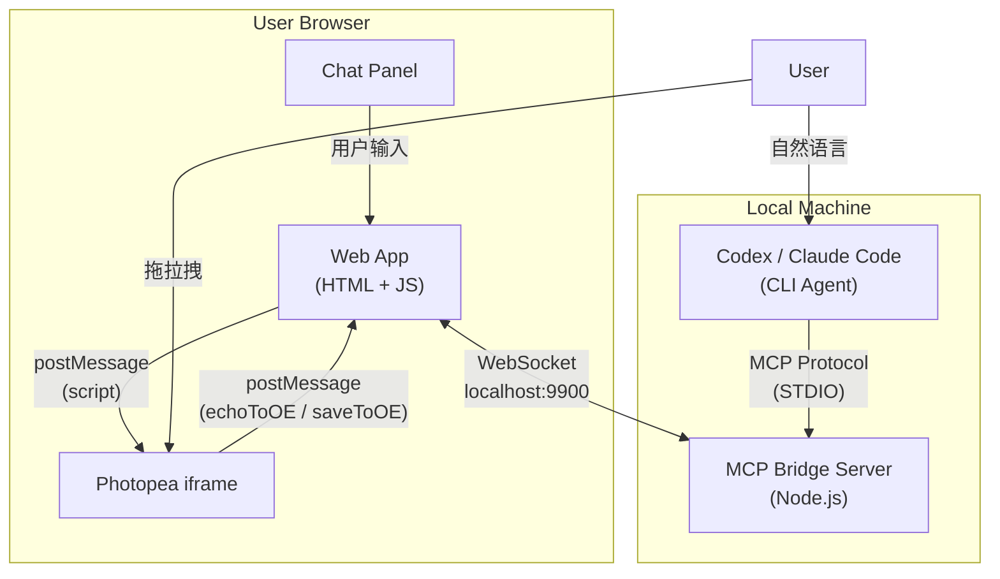
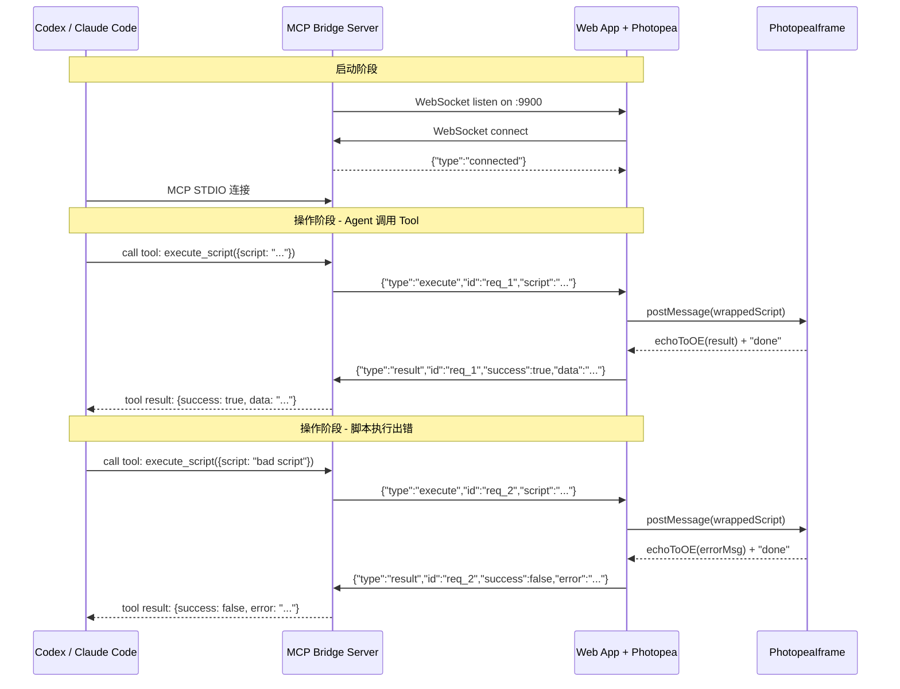
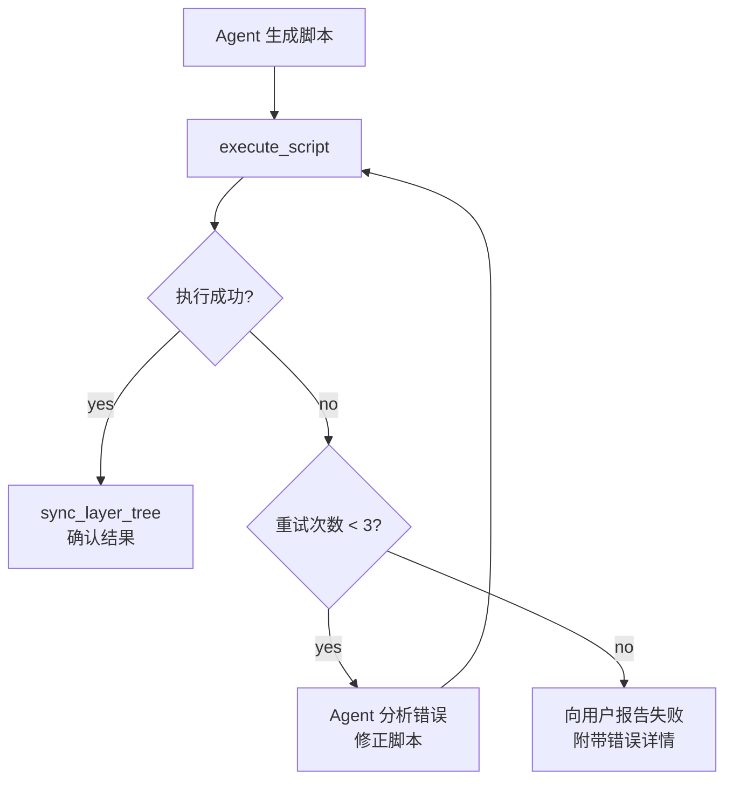

# 自然语言 PSD/PSB 编辑 Agent -- v2 顶层架构设计

> **版本**: v2（基于 v1 迭代）
> **更新日期**: 2026-03-26
> **状态**: 方案锁定，待技术验证
> **锁定决策**: PSD 引擎 = 方案 D（Photopea 内核 + AI 编排层），Agent 模式 = 模式 A（本地 Codex / Claude Code）

---

## 一、架构总览

### 1.1 核心理念

整个系统由三层构成：

- **PSD 引擎层 (Photopea)**: 负责 PSD/PSB 的解析、渲染、编辑、导出，运行在用户浏览器 iframe 中
- **桥接层 (MCP Bridge Server)**: 本地 Node.js 进程，双重角色——对 Agent 暴露 MCP Tools，对浏览器提供 WebSocket 通道
- **智能层 (Codex / Claude Code)**: 本地 CLI Agent，理解自然语言，调用 MCP Tools 生成操作脚本

Agent 不直接接触 PSD 文件。它生成 Photopea 脚本 -> 通过 Bridge 发到浏览器 -> Photopea 在客户端执行 -> 结果回传。

### 1.2 架构总图



### 1.3 与 v1 的关键变化

| 变化点 | v1 | v2 |
|--------|----|----|
| Agent 与浏览器的通信 | 未明确 | 通过 MCP Bridge Server (WebSocket) |
| Tool 输出 | 纯脚本字符串 | 脚本字符串 + 执行确认（Bridge 等待 Photopea 返回 "done"） |
| 图层上下文 | Agent 被动接收 | Agent 主动调用 `sync_layer_tree` Tool |
| Photopea UI | 默认 | 定制 environment（精简面板 + customIO） |
| 错误处理 | 未设计 | try-catch 包裹 + echoToOE 回报错误 + Agent 重试 |

---

## 二、MCP Bridge Server 详细设计

### 2.1 职责

MCP Bridge Server 是整个架构的枢纽，扮演双重角色：

1. **对 Agent (上游)**: 通过 STDIO 暴露 MCP Tools，被 Codex/Claude Code 调用
2. **对浏览器 (下游)**: 通过 WebSocket 与 Web App 通信，转发脚本并等待执行结果

### 2.2 通信协议



### 2.3 WebSocket 消息格式

**Bridge -> Browser:**

```json
{
  "type": "execute",
  "id": "req_001",
  "script": "app.activeDocument.layers[0].visible = false;"
}
```

**Browser -> Bridge:**

```json
{
  "type": "result",
  "id": "req_001",
  "success": true,
  "data": null
}
```

```json
{
  "type": "result",
  "id": "req_002",
  "success": true,
  "data": "{\"layers\":[...]}"
}
```

```json
{
  "type": "result",
  "id": "req_003",
  "success": false,
  "error": "ReferenceError: xxx is not defined"
}
```

### 2.4 脚本包装策略

浏览器端在发送脚本给 Photopea 前，用 try-catch 包裹以捕获错误：

```javascript
function wrapScript(requestId, userScript) {
  return `
    try {
      ${userScript}
      app.echoToOE(JSON.stringify({id:"${requestId}",ok:true}));
    } catch(e) {
      app.echoToOE(JSON.stringify({id:"${requestId}",ok:false,err:e.message}));
    }
  `;
}
```

Photopea 执行完脚本后会先发送 echoToOE 的内容（JSON 字符串），然后发送 `"done"`。浏览器根据 `id` 匹配请求和响应。

### 2.5 MCP Tools 定义

Bridge 对 Agent 暴露以下 MCP Tools：

```
Tool: execute_script
  Description: 在 Photopea 中执行一段 JavaScript 脚本
  Input: { script: string }
  Output: { success: boolean, data?: string, error?: string }

Tool: sync_layer_tree
  Description: 获取当前 PSD 的完整图层树结构（JSON）
  Input: {}
  Output: { layers: LayerNode[] }
  实现: 内部调用 execute_script，发送图层遍历脚本

Tool: get_document_info
  Description: 获取当前文档的基本信息
  Input: {}
  Output: { width, height, colorMode, resolution, name }

Tool: load_file
  Description: 让 Photopea 打开一个文件（URL 或 base64）
  Input: { url?: string, base64?: string }
  Output: { success: boolean }

Tool: export_file
  Description: 导出当前文档为指定格式
  Input: { format: "psd"|"png"|"jpg"|"webp", quality?: number }
  Output: { success: boolean, data: base64_string }
```

关键设计变化（相比 v1）：

- **v1 思路**: 每种 PSD 操作一个 Tool（modify_text、toggle_layer 等），Tool 返回脚本字符串
- **v2 思路**: 一个通用 `execute_script` Tool + 几个高频便捷 Tool。Agent 自由生成 Photopea 脚本，Bridge 负责执行和结果回收

**为什么改**: Agent (LLM) 本身就擅长生成代码/脚本。与其预定义有限的操作 Tool，不如让 Agent 直接生成 Photopea JS 脚本，配合 `sync_layer_tree` 了解当前状态。这样：
- 操作不受 Tool 预定义的限制，Agent 可以组合任意操作
- 减少 Tool 数量，降低 Agent 的决策复杂度
- 更容易扩展能力范围（不需要新增 Tool，只需在 System Prompt 中提供新的脚本示例）

---

## 三、Agent 集成细节

### 3.1 Codex 集成方式

Codex 通过 MCP Server 连接 Bridge。配置文件 `.codex/config.toml`：

```toml
[mcp_servers.psd_bridge]
command = "node"
args = ["./bridge/server.js"]
```

Codex Skill 文件 `.agents/skills/psd-editor/SKILL.md`：

```markdown
---
name: psd-editor
description: |
  自然语言编辑 PSD/PSB 文件。当用户想要修改 PSD 文件中的文字、图层、
  颜色、位置等内容时使用此技能。通过 MCP Bridge 连接浏览器中的 Photopea 编辑器。
---

## 工作流程

1. 调用 `sync_layer_tree` 获取当前文档的图层结构
2. 分析用户的自然语言指令，理解要操作的目标图层和操作类型
3. 生成 Photopea JavaScript 脚本
4. 调用 `execute_script` 执行脚本
5. 如果执行失败，分析错误信息，修正脚本，重试（最多 3 次）
6. 执行成功后，再次调用 `sync_layer_tree` 确认结果

## Photopea 脚本 API 参考

[此处嵌入 Photopea 脚本速查手册...]
```

### 3.2 Claude Code 集成方式

Claude Code 同样通过 MCP 连接。配置文件 `.mcp.json`：

```json
{
  "mcpServers": {
    "psd_bridge": {
      "command": "node",
      "args": ["./bridge/server.js"]
    }
  }
}
```

Claude Code 项目指引 `CLAUDE.md`：

```markdown
# NL-PSD Agent

本项目通过 MCP Bridge 连接浏览器中的 Photopea，实现自然语言编辑 PSD 文件。

## 可用 MCP Tools

- `execute_script`: 在 Photopea 中执行 JS 脚本
- `sync_layer_tree`: 获取当前图层树
- `get_document_info`: 获取文档基本信息
- `load_file`: 打开文件
- `export_file`: 导出文件

## 工作流程

1. 先调用 sync_layer_tree 了解文档结构
2. 根据用户指令生成 Photopea JS 脚本
3. 通过 execute_script 执行
4. 检查执行结果，失败则修正重试

## Photopea 脚本注意事项

- 图层通过 `app.activeDocument.layers` 或 `artLayers` 访问
- 图层组通过 `layerSets` 访问
- 文字图层通过 `artLayer.textItem` 操作
- 颜色使用 `new SolidColor()` 创建
- 发送数据回外部使用 `app.echoToOE()`
```

### 3.3 Agent System Prompt 核心要素

无论 Codex 还是 Claude Code，Agent 的核心上下文包括：

1. **角色定义**: 你是一个 PSD 编辑助手，通过生成 Photopea 脚本来操作用户的 PSD 文件
2. **当前图层树**: （每次对话前通过 `sync_layer_tree` 动态获取）
3. **脚本 API 速查**: Photopea/Adobe JS 脚本的常用操作示例
4. **约束条件**:
   - 操作前先理解图层结构
   - 脚本中引用图层时用 `getByName()` 或索引
   - 操作后验证结果
   - 出错时分析原因并重试
5. **Few-shot 示例**: 常见用户指令 -> 对应脚本的映射样例

---

## 四、浏览器端 Web App 设计

### 4.1 Photopea 环境定制

通过 `environment` 参数精简 Photopea UI，只保留必要面板：

```json
{
  "environment": {
    "theme": 2,
    "vmode": 0,
    "panels": [2, 0],
    "customIO": {
      "open": "app.echoToOE('__CUSTOM_OPEN__');",
      "save": "app.echoToOE('__CUSTOM_SAVE__');"
    },
    "localsave": false
  }
}
```

- `panels: [2, 0]`: 只显示 Layers 面板和 History 面板
- `customIO`: 拦截"打开"和"保存"操作，由我们的 Web App 接管
- `localsave: false`: 禁用默认保存功能

### 4.2 Web App 核心模块

```
web-app/
├── index.html              # 主页面：Photopea iframe + Chat 面板
├── js/
│   ├── bridge-client.js    # WebSocket 客户端，连接 MCP Bridge
│   ├── photopea-adapter.js # Photopea postMessage 封装
│   ├── chat-ui.js          # Chat 面板交互逻辑
│   └── app.js              # 主逻辑，粘合各模块
└── css/
    └── style.css           # 布局样式
```

### 4.3 photopea-adapter.js 核心逻辑

```javascript
class PhotopeaAdapter {
  constructor(iframeElement) {
    this.iframe = iframeElement;
    this.pendingRequests = new Map();
    this.ready = false;
    
    window.addEventListener("message", (e) => this._onMessage(e));
  }

  _onMessage(event) {
    const data = event.data;
    
    if (data === "done") {
      this.ready = true;
      return;
    }

    if (typeof data === "string") {
      try {
        const parsed = JSON.parse(data);
        if (parsed.id && this.pendingRequests.has(parsed.id)) {
          const resolve = this.pendingRequests.get(parsed.id);
          this.pendingRequests.delete(parsed.id);
          resolve(parsed);
        }
      } catch(e) { /* non-JSON echo, ignore */ }
    }

    if (data instanceof ArrayBuffer) {
      // 文件导出数据
    }
  }

  executeScript(requestId, script) {
    return new Promise((resolve) => {
      this.pendingRequests.set(requestId, resolve);
      const wrapped = `
        try {
          ${script}
          app.echoToOE(JSON.stringify({id:"${requestId}",ok:true}));
        } catch(e) {
          app.echoToOE(JSON.stringify({id:"${requestId}",ok:false,err:e.message}));
        }
      `;
      this.iframe.contentWindow.postMessage(wrapped, "*");
    });
  }

  loadFile(arrayBuffer) {
    this.iframe.contentWindow.postMessage(arrayBuffer, "*");
  }
}
```

---

## 五、图层上下文同步协议

### 5.1 图层树提取脚本

当 Agent 调用 `sync_layer_tree` 时，Bridge 会向浏览器发送以下脚本：

```javascript
function extractLayers(parent) {
  var result = [];
  for (var i = 0; i < parent.layers.length; i++) {
    var layer = parent.layers[i];
    var node = {
      name: layer.name,
      kind: layer.typename,
      visible: layer.visible,
      opacity: layer.opacity,
      blendMode: layer.blendMode.toString(),
      bounds: {
        left: layer.bounds[0].as("px"),
        top: layer.bounds[1].as("px"),
        right: layer.bounds[2].as("px"),
        bottom: layer.bounds[3].as("px")
      }
    };
    if (layer.typename === "ArtLayer" && layer.kind.toString() === "LayerKind.TEXT") {
      node.textContent = layer.textItem.contents;
      node.fontSize = layer.textItem.size.as("px");
    }
    if (layer.typename === "LayerSet") {
      node.children = extractLayers(layer);
    }
    result.push(node);
  }
  return result;
}
var doc = app.activeDocument;
var tree = {
  name: doc.name,
  width: doc.width.as("px"),
  height: doc.height.as("px"),
  resolution: doc.resolution,
  layers: extractLayers(doc)
};
app.echoToOE(JSON.stringify(tree));
```

### 5.2 同步时机

| 触发点 | 动作 |
|--------|------|
| PSD 文件首次加载完成 | 自动执行 sync_layer_tree |
| Agent 执行完一个操作后 | Agent 主动调用 sync_layer_tree |
| 用户手动编辑后（焦点切换等） | Web App 检测到 Photopea 发来操作完成信号后，主动推送更新给 Bridge |
| Agent 对话开始前 | Agent 先调用 sync_layer_tree 获取最新状态 |

### 5.3 增量同步 vs 全量同步

MVP 阶段使用全量同步（每次重新提取完整图层树）。原因：
- 实现简单
- 基础操作场景下图层树不会太大（几十到几百个图层）
- Photopea 脚本执行速度快，遍历图层树在毫秒级

后续优化可考虑增量同步（只同步变化的部分），但优先级低。

---

## 六、错误处理与重试机制

### 6.1 错误分类

| 错误类型 | 示例 | 处理策略 |
|----------|------|---------|
| 脚本语法错误 | `SyntaxError: Unexpected token` | Agent 修正脚本语法后重试 |
| 图层不存在 | `Error: no such element "Title"` | Agent 重新 sync_layer_tree 获取正确图层名后重试 |
| 操作不适用 | 对非文字图层设置 textItem | Agent 分析图层类型后调整操作 |
| Photopea 未就绪 | iframe 未加载完成 | Bridge 排队等待，超时后报错 |
| WebSocket 断开 | 网络中断 | 自动重连 + 请求队列重发 |

### 6.2 重试流程



### 6.3 脚本安全包裹

所有发往 Photopea 的脚本都经过 try-catch 包裹（见 4.3 节 `PhotopeaAdapter`），确保错误信息能可靠地通过 `echoToOE` 回传，不会导致 Photopea 静默失败。

---

## 七、开发工作流

### 7.1 日常开发流程

```
1. 启动 MCP Bridge Server
   $ node bridge/server.js
   -> WebSocket 监听 localhost:9900
   -> MCP STDIO 就绪

2. 启动 Web App（开发服务器）
   $ npx serve web-app/
   -> 浏览器访问 localhost:3000
   -> Photopea iframe 加载
   -> WebSocket 自动连接 Bridge

3. 启动 Agent
   $ codex             # 或 claude
   -> Agent 通过 MCP 连接 Bridge
   -> 用自然语言指令开始操作

4. 开发调试
   - 浏览器 DevTools 查看 postMessage 通信
   - Bridge 控制台查看 MCP Tool 调用日志
   - Agent 输出查看生成的脚本和执行结果
```

### 7.2 项目结构

```
nl-psd-agent/
├── README.md
├── plans/                    # 架构设计文档
├── research/                 # 调研资料
├── references/               # 参考资料
│
├── bridge/                   # MCP Bridge Server
│   ├── server.js             # 主入口 (STDIO MCP + WebSocket)
│   ├── tools/                # MCP Tool 定义
│   │   ├── execute-script.js
│   │   ├── sync-layer-tree.js
│   │   ├── get-document-info.js
│   │   ├── load-file.js
│   │   └── export-file.js
│   ├── scripts/              # 预定义的 Photopea 脚本模板
│   │   └── extract-layers.js
│   └── package.json
│
├── web-app/                  # 前端 Web App
│   ├── index.html
│   ├── js/
│   │   ├── photopea-adapter.js
│   │   ├── bridge-client.js
│   │   └── app.js
│   └── css/
│       └── style.css
│
├── skills/                   # Agent Skills (Codex 格式)
│   └── psd-editor/
│       └── SKILL.md
│
├── .codex/                   # Codex 配置
│   └── config.toml
├── .mcp.json                 # Claude Code MCP 配置
└── CLAUDE.md                 # Claude Code 项目指引
```

---

## 八、分阶段实施路线（更新）

### Phase 0: 技术验证 (1 周)

**目标**: 验证 Photopea iframe 嵌入 + postMessage 通信 + 脚本执行的可行性

- [ ] 创建最简 HTML 页面，嵌入 Photopea iframe
- [ ] 实现 postMessage 发送脚本 + 接收结果
- [ ] 实现文件加载（拖拽 PSD 到 iframe 或通过 ArrayBuffer）
- [ ] 验证图层树提取脚本
- [ ] 验证 try-catch 错误捕获
- [ ] 验证 environment 配置（面板精简、customIO）

**交付物**: 一个能手动执行脚本并看到结果的 HTML 页面

### Phase 1: MCP Bridge + 核心链路 (2 周)

**目标**: 跑通 Agent -> Bridge -> Photopea 完整链路

- [ ] 实现 MCP Bridge Server（STDIO MCP + WebSocket）
- [ ] 实现 5 个 MCP Tools (execute_script, sync_layer_tree, get_document_info, load_file, export_file)
- [ ] 编写 Codex Skill / CLAUDE.md
- [ ] 配置 Codex/Claude Code 的 MCP Server
- [ ] 端到端测试：自然语言 -> Agent 生成脚本 -> Bridge 转发 -> Photopea 执行 -> 结果回传
- [ ] 验证错误处理和重试流程

**交付物**: 可通过 Codex/Claude Code 用自然语言操作 PSD 的完整链路

### Phase 2: Web App + Chat UI (2 周)

**目标**: 整合为可用的 Web 应用

- [ ] 实现 Chat UI 面板
- [ ] 实现文件上传/拖拽加载
- [ ] 布局：左 Chat + 右 Photopea
- [ ] Chat 消息历史展示
- [ ] 操作日志/状态显示
- [ ] 导出功能

**交付物**: 完整的 Web MVP

### Phase 3: 体验优化 (持续)

- [ ] Agent 准确性优化（更好的 few-shot examples）
- [ ] 操作范围扩展（滤镜、调色、蒙版等中级操作）
- [ ] 性能优化（大文件处理、增量同步）
- [ ] 抽象 PSD Engine 接口，为替换 Photopea 做准备

---

## 九、风险清单（更新）

| 风险 | 严重程度 | 概率 | 缓解措施 |
|------|---------|------|---------|
| Photopea 依赖（个人项目） | 高 | 中 | 抽象 Engine 接口；自托管版本作为备选 |
| Agent 生成脚本质量不稳定 | 中 | 高 | Few-shot 示例库 + 错误重试 + 渐进式增加操作复杂度 |
| 图层上下文同步延迟 | 中 | 中 | 关键操作后强制同步；MVP 用全量同步 |
| PSB 大文件浏览器内存溢出 | 高 | 低 | 实测 Photopea 大文件能力；设上限告警 |
| Photopea 脚本 API 兼容性 | 中 | 中 | 建立脚本测试集；锁定 Photopea 版本（自托管） |
| WebSocket 连接稳定性 | 低 | 低 | 自动重连 + 请求队列 |

---

## 十、附录：v1 选型分析结论

v1 中对 4 种 PSD 引擎方案做了详细对比，最终选择方案 D（Photopea 内核 + AI 编排层）。详见 [v1-architecture.md](./v1-architecture.md)。
