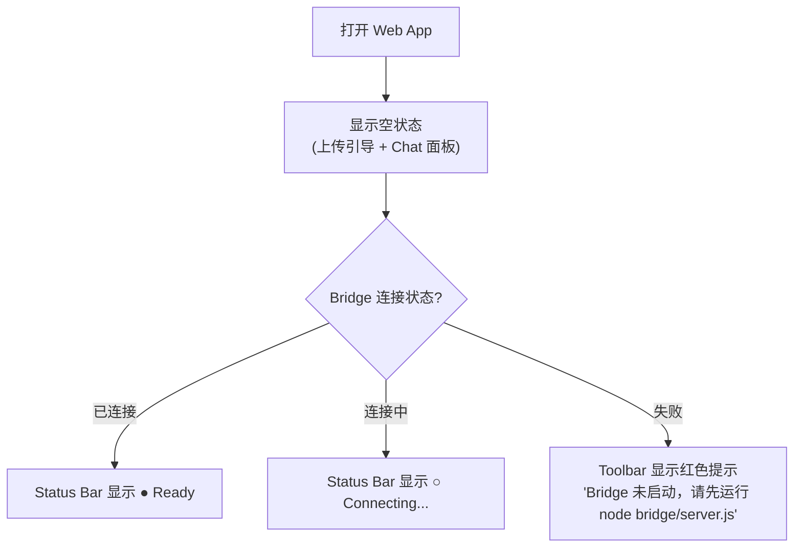
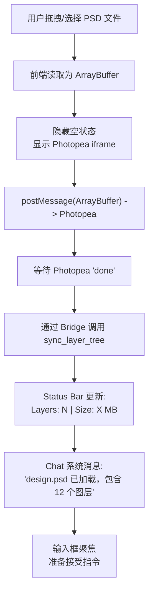
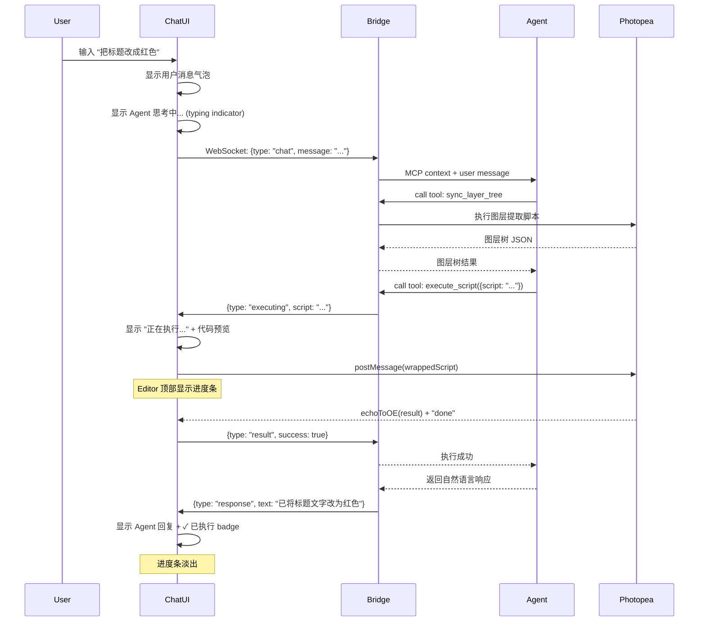

# 自然语言 PSD/PSB 编辑 Agent -- v3 前端 UI/UX 设计

> **版本**: v3
> **更新日期**: 2026-03-26
> **状态**: 设计稿，待讨论确认
> **设计调性**: 专业工具感（Figma/Linear 路线）-- 克制、高效、功能优先

---

## 一、技术栈选型

**推荐: React 18 + Tailwind CSS 4**

| 选项 | 优势 | 劣势 | 评价 |
|------|------|------|------|
| Vanilla | 零依赖，最轻量 | 状态管理混乱，维护性差 | MVP 可以但扩展痛苦 |
| React + Tailwind | 生态最大，组件丰富（分栏/WebSocket/Chat），团队熟悉度高 | 包体积稍大 | **推荐** |
| Vue 3 | 学习曲线平缓，内置响应式 | 分栏/Chat 生态不如 React | 备选 |
| Svelte | 编译时优化，代码量少 | 生态较小，招人难 | 适合个人项目 |

关键依赖:
- `react-resizable-panels`: 可拖拽分栏
- `zustand`: 轻量状态管理（比 Redux 简洁）
- 原生 WebSocket API（不需要库）

---

## 二、布局结构

### 2.1 整体布局

```
┌──────────────────────────────────────────────────────────────┐
│  Toolbar                                                     │
│  [Upload] [Export ▾]   design.psd        [● Bridge Connected]│
├─────────────────────┬────────────────────────────────────────┤
│                     │                                        │
│  Chat Panel         ║  Photopea Editor (iframe)              │
│  (320px default)    ║  (flex: 1)                             │
│                     ║                                        │
│  ┌───────────────┐  ║                                        │
│  │ Message List  │  ║                                        │
│  │               │  ║                                        │
│  │ agent: ...    │  ║                                        │
│  │ user: ...     │  ║                                        │
│  │ agent: ...    │  ║                                        │
│  │               │  ║                                        │
│  │  [executing]  │  ║                                        │
│  │               │  ║                                        │
│  └───────────────┘  ║                                        │
│  ┌───────────────┐  ║                                        │
│  │ > Input...  ⏎ │  ║                                        │
│  └───────────────┘  ║                                        │
├─────────────────────┴────────────────────────────────────────┤
│  Status: 12 layers │ 2.4 MB │ Last sync: 2s ago      bridge │
└──────────────────────────────────────────────────────────────┘
```

### 2.2 三栏分区

| 区域 | 高度/宽度 | 内容 | 交互 |
|------|----------|------|------|
| **Toolbar** | 固定 40px | 文件操作 + 文档名 + 连接状态 | 点击触发操作 |
| **Chat Panel** | 满高，默认 320px 宽 | 对话历史 + 输入框 | 可拖拽调宽，可折叠 |
| **Editor Panel** | 满高，flex:1 | Photopea iframe | 拖拽 PSD 上传 + 手动编辑 |
| **Status Bar** | 固定 28px | 图层数/文件大小/同步时间/连接状态 | 纯信息展示 |

### 2.3 分栏交互

- **拖拽调宽**: 中间分隔线 (4px) 可左右拖拽，Chat Panel 最小 240px，最大 50% 视口宽
- **折叠 Chat**: 双击分隔线或点击 Toolbar 上的 toggle 按钮，Chat 折叠为 0，Editor 全屏
- **快捷键**: `Cmd/Ctrl + \` 切换 Chat 面板显隐

---

## 三、视觉设计系统

### 3.1 调色板

走 Figma/Linear 路线：深色系 UI chrome + 白色/浅色内容区。不用纯黑，用品牌色微调的深灰。

```css
:root {
  /* Surface - 深色 chrome，微调偏冷 */
  --surface-bg:       oklch(14% 0.008 260);   /* 主背景 (近黑，微蓝) */
  --surface-raised:   oklch(18% 0.008 260);   /* 抬升表面 (Toolbar, Status Bar) */
  --surface-overlay:  oklch(22% 0.008 260);   /* 覆盖层 (下拉菜单) */

  /* Text */
  --text-primary:     oklch(92% 0.005 260);   /* 主文字 */
  --text-secondary:   oklch(62% 0.008 260);   /* 次级文字 */
  --text-muted:       oklch(45% 0.005 260);   /* 弱化文字 */

  /* Accent - 取一个克制的蓝，不是 AI 蓝 */
  --accent:           oklch(62% 0.18 250);    /* 主强调色 */
  --accent-hover:     oklch(68% 0.18 250);    /* hover 态 */
  --accent-muted:     oklch(30% 0.06 250);    /* 低调底色 */

  /* Semantic */
  --success:          oklch(65% 0.15 155);
  --error:            oklch(60% 0.2 25);
  --warning:          oklch(72% 0.15 85);

  /* Border */
  --border:           oklch(25% 0.005 260);   /* 分割线 */
  --border-subtle:    oklch(20% 0.005 260);   /* 极弱分割线 */
}
```

### 3.2 字体

避免 Inter/Roboto，选择有辨识度但克制的字体：

- **UI 字体**: `"Plus Jakarta Sans", system-ui, sans-serif` -- 比 Inter 更有个性，但同样清晰
- **代码/脚本**: `"JetBrains Mono", "Fira Code", monospace` -- 用于显示执行的脚本片段
- **大小**: 基于 13px 基础值（专业工具偏紧凑），14px 用于 Chat 消息体

### 3.3 间距

4pt 基础，专业工具偏紧凑但不拥挤：

```
--space-1: 4px     /* 最小间距 */
--space-2: 8px     /* 元素内间距 */
--space-3: 12px    /* 组件间距 */
--space-4: 16px    /* 区块间距 */
--space-6: 24px    /* 大区块 */
--space-8: 32px    /* 页面级 */
```

### 3.4 无阴影设计

参考 Linear 的做法：不使用 box-shadow 做层级区分，改用细边框 (1px border) + 微小的表面色差。这更克制、更"工具"。

---

## 四、组件设计详解

### 4.1 Toolbar

```
┌─────────────────────────────────────────────────────┐
│ ☰  [Upload]  [Export ▾]     design.psd      ● Ready │
└─────────────────────────────────────────────────────┘
```

- 高度: 40px，`surface-raised` 背景，底部 1px border
- 左侧: Chat 面板 toggle (☰)、Upload 按钮、Export 下拉
- 中间: 当前文档名（可编辑态：双击重命名）
- 右侧: Bridge 连接状态指示（绿点 = 已连接，黄点 = 连接中，红点 = 断开）
- 按钮样式: ghost button（无背景，hover 时微亮），小写文字，无图标堆砌

### 4.2 Chat Panel

#### 消息类型

| 类型 | 视觉处理 |
|------|---------|
| 用户消息 | 右对齐，accent-muted 背景圆角块 |
| Agent 消息 | 左对齐，无背景/极淡背景，左侧 2px accent 竖线 |
| 系统消息 | 居中，text-muted 小字，例如"文件已加载" |
| 脚本执行中 | Agent 消息块内，单行代码预览 + 旋转加载指示器 |
| 执行成功 | 绿色微 badge "已执行"，一行摘要 |
| 执行失败 | 红色微 badge "失败" + 错误摘要，可展开详情 |

#### Agent 消息中的脚本展示

当 Agent 生成并执行脚本时，Chat 中显示：

```
┌──────────────────────────────────────┐
│ ┃ 已将标题文字改为红色                 │
│ ┃                                    │
│ ┃ ▸ 查看执行的脚本                    │  ← 可折叠
│ ┃   ┌────────────────────────────┐   │
│ ┃   │ var color = new SolidCo... │   │  ← 单行代码预览 + 展开
│ ┃   └────────────────────────────┘   │
│ ┃                          ✓ 已执行   │
└──────────────────────────────────────┘
```

- 脚本默认折叠，点击"查看执行的脚本"展开
- 代码区用 monospace 字体，`surface-bg` 背景
- "已执行" badge 用 success 色

#### 输入框

- 底部固定，`surface-raised` 背景
- 单行模式，按 Enter 发送，Shift+Enter 换行
- 右侧发送按钮（ghost style，有内容时变 accent）
- Placeholder: "描述你想做的修改..."
- 发送中禁用输入 + 显示加载状态

### 4.3 Editor Panel (Photopea iframe)

- iframe 占满整个 Editor Panel，无内边距
- Photopea environment 定制：
  - 只保留 Layers 和 History 面板
  - 深色主题匹配我们的 UI
  - 隐藏 File - Open/Save（由我们接管）

#### 空状态（无文件时）

不显示空 Photopea。改为显示一个上传引导区：

```
┌──────────────────────────────────────┐
│                                      │
│         ┌──────────────┐             │
│         │   ↑          │             │
│         │  拖拽 PSD/PSB │             │
│         │  文件到此处    │             │
│         │              │             │
│         │  或 点击上传   │             │
│         └──────────────┘             │
│                                      │
│  支持 .psd .psb 格式                  │
│                                      │
└──────────────────────────────────────┘
```

- 虚线边框区域，拖入时高亮
- 文件加载后，空状态消失，Photopea iframe 出现

#### 执行指示

脚本执行期间，Editor Panel 顶部显示一条极窄的 accent 色进度条（不确定进度，用 indeterminate 动画），完成后淡出。

### 4.4 Status Bar

```
┌──────────────────────────────────────────────────────┐
│  Layers: 12  │  2.4 MB  │  Synced 2s ago      ● ws  │
└──────────────────────────────────────────────────────┘
```

- 高度: 28px，`surface-raised` 背景，顶部 1px border
- 左侧: 图层数量、文件大小
- 右侧: 最后同步时间、WebSocket 状态微标
- 字号 12px，text-secondary 色

---

## 五、交互流程详解

### 5.1 首次进入



### 5.2 文件加载流程



### 5.3 自然语言编辑流程



### 5.4 错误恢复 UX

脚本执行失败时，用户看到：

```
┌──────────────────────────────────────┐
│ ┃ 抱歉，执行出错了。                   │
│ ┃ 找不到名为 "Title" 的图层。          │
│ ┃                                    │
│ ┃ 已重新检查图层结构，正在重试...       │  ← Agent 自动重试
│ ┃                              ✗ 失败 │
│ ┃                              ↻ 重试中│
└──────────────────────────────────────┘
```

Agent 自动重试（最多 3 次），用户看到重试状态。如果最终失败：

```
│ ┃ 无法完成操作。可能的原因：            │
│ ┃ 当前文档中没有文字图层。              │
│ ┃                                    │
│ ┃ 你可以试试：                        │
│ ┃ - "显示所有图层" 查看当前结构         │
│ ┃ - 手动选中目标图层后再描述操作        │
│ ┃                         ✗ 最终失败   │
```

---

## 六、动效设计

遵循 Impeccable 的 motion-design 原则，只在关键时刻使用动效：

| 时刻 | 动效 | 时长 | 曲线 |
|------|------|------|------|
| Chat 消息出现 | 从下往上滑入 + 透明度 | 200ms | ease-out-quart |
| Agent 思考中 | 三个点脉冲动画 | 循环 | ease-in-out |
| 脚本执行进度条 | indeterminate 水平扫描 | 循环 | linear |
| 进度条完成消失 | 透明度淡出 | 300ms | ease-out |
| 面板折叠/展开 | 宽度过渡 (transform) | 250ms | ease-out-quart |
| 文件拖拽 hover | 边框颜色 + 背景微亮 | 150ms | ease-out |
| 连接状态指示 | 慢呼吸脉冲 (连接中) | 2000ms | ease-in-out |

**不使用**: bounce/elastic 曲线、大范围位移动画、装饰性动效。

---

## 七、响应式策略

### 桌面（> 1024px）

标准左右分栏布局。Chat 面板默认 320px。

### 平板（768px - 1024px）

Chat 面板收窄为 280px，或默认折叠为侧边图标栏（点击展开为 overlay）。

### 移动端（< 768px）

切换为标签模式：底部 Tab 栏 [Chat] [Editor]，两个视图全屏切换。这个优先级较低，MVP 可以只做桌面。

---

## 八、可访问性

- 所有按钮有 `aria-label`
- Chat 消息用 `role="log"` + `aria-live="polite"` 让屏幕阅读器播报新消息
- 键盘导航：Tab 在主区域间切换，Enter 发送消息
- 对比度：所有文字至少 4.5:1（text-secondary 在深色背景上也达标）
- `prefers-reduced-motion`: 禁用滑动动画，只保留透明度过渡
- `prefers-color-scheme`: MVP 只做深色主题（匹配 Photopea），后续可加浅色

---

## 九、项目文件结构（前端）

```
web-app/
├── index.html
├── package.json
├── vite.config.ts              # Vite 作为构建工具
├── tailwind.config.ts
├── tsconfig.json
├── public/
│   └── favicon.svg
├── src/
│   ├── main.tsx                # 入口
│   ├── App.tsx                 # 根组件（布局容器）
│   ├── components/
│   │   ├── Toolbar.tsx         # 顶部工具栏
│   │   ├── ChatPanel.tsx       # 左侧 Chat 面板
│   │   ├── MessageList.tsx     # 消息列表
│   │   ├── MessageBubble.tsx   # 单条消息（用户/Agent/系统）
│   │   ├── ChatInput.tsx       # 输入框
│   │   ├── EditorPanel.tsx     # 右侧 Editor 面板
│   │   ├── PhotopeaFrame.tsx   # Photopea iframe 封装
│   │   ├── EmptyState.tsx      # 空状态（上传引导）
│   │   ├── StatusBar.tsx       # 底部状态栏
│   │   └── ProgressBar.tsx     # 脚本执行进度条
│   ├── services/
│   │   ├── bridge-client.ts    # WebSocket 客户端
│   │   ├── photopea-adapter.ts # Photopea postMessage 封装
│   │   └── file-handler.ts     # 文件上传/拖拽处理
│   ├── stores/
│   │   ├── chat-store.ts       # Chat 状态 (zustand)
│   │   ├── editor-store.ts     # Editor/文档状态
│   │   └── connection-store.ts # Bridge 连接状态
│   ├── types/
│   │   └── index.ts            # TypeScript 类型定义
│   └── styles/
│       └── globals.css         # CSS 变量 + 基础样式
└── .impeccable.md              # Impeccable 设计上下文
```

---

## 十、`.impeccable.md` 设计上下文文件

```markdown
## Design Context

**Product**: NL-PSD Agent -- 自然语言 PSD/PSB 编辑工具
**Target audience**: 普通用户，非设计师。需要对 PSD 模板做简单修改（换文字、调颜色、显隐图层）
**Use cases**: 上传 PSD 模板 -> 用自然语言描述修改 -> 实时看到结果 -> 导出
**Brand personality/tone**: 专业工具感。克制、高效、功能优先。类似 Figma/Linear 的气质。不花哨，不卖萌，让用户觉得"这个工具很靠谱"。
**Visual direction**: 深色 UI chrome + 紧凑布局 + 细边框分割 + 无阴影 + 品牌蓝强调色

**DO NOT**:
- 不要用亮色/白色主题（要匹配 Photopea 深色界面）
- 不要用圆角卡片嵌套
- 不要用 glassmorphism 或发光效果
- 不要用 emoji 或装饰性图标
```
